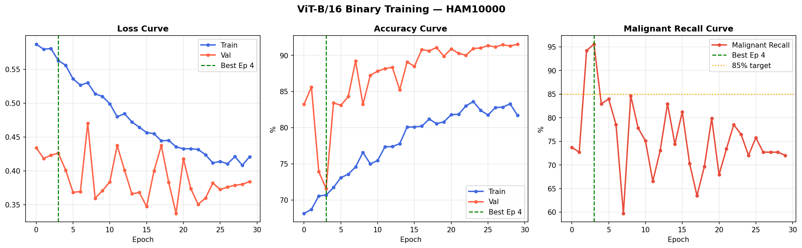
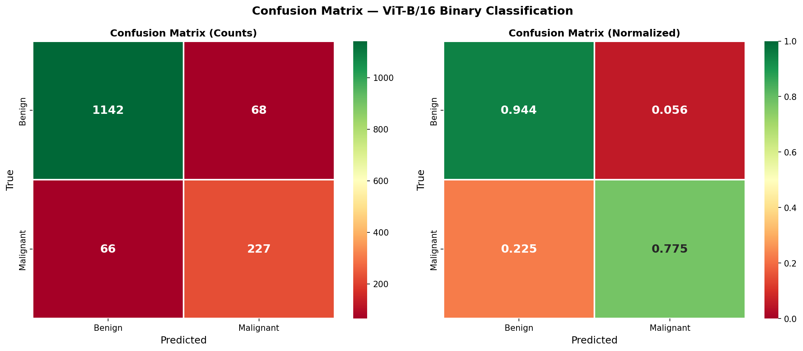
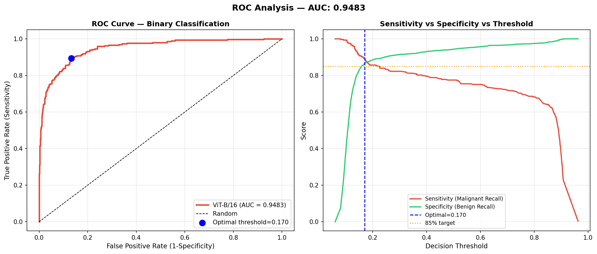
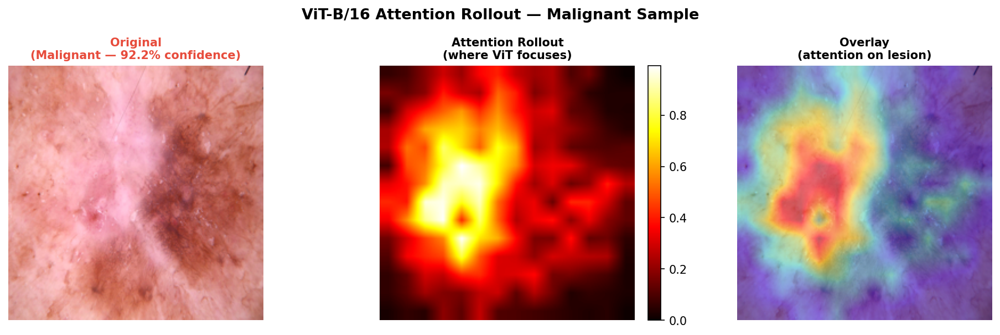
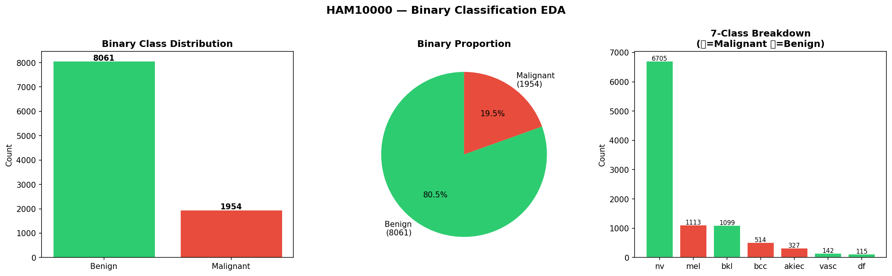

# 🔬 Skin Cancer Detection Using Vision Transformer (ViT-B/16)

[](https://colab.research.google.com/drive/1DqT-l7eAdFLUhcKk-qmx78tgOZD3UWdf?usp=sharing)


Fine-tuning ViT-B/16 (ImageNet-21k) on the HAM10000 dermoscopy dataset for binary skin cancer malignancy detection — optimized for clinical recall to minimize missed cancer cases.

---

## 🎯 Clinical Motivation

In skin lesion screening, the critical question is: **"Is this lesion malignant or benign?"** The exact subtype (melanoma vs BCC vs AK) is determined by subsequent biopsy. This model flags high-risk cases for immediate dermatologist referral.

**Clinical Priority: Recall over Precision.** Missing a cancer is far more dangerous than a false alarm. The model is trained and evaluated with this clinical reality in mind.

---

## 📊 Results

| Metric | Score |
|---|---|
| Test Accuracy | **91.08%** |
| Malignant Recall (Sensitivity) | **77.47%** |
| Malignant Precision | **76.95%** |
| Benign Recall (Specificity) | **94.38%** |
| Macro F1 | **0.8583** |
| AUC-ROC | **0.9483** |

### Confusion Matrix

| | Predicted Benign | Predicted Malignant |
|---|---|---|
| **Actual Benign** | 1142 ✅ | 68 |
| **Actual Malignant** | 66 ⚠️ | 227 ✅ |

66 missed cancers and 68 false alarms on 1,503 test images.

### Threshold Optimization

At optimal threshold **(0.1699)**:

| Metric | Score |
|---|---|
| Sensitivity | **89.42%** |
| Specificity | **86.69%** |

In clinical deployment, lowering the threshold from 0.5 to 0.1699 captures 89.42% of all cancer cases — demonstrating the flexibility of the AUC-based approach.

### ViT-B/16 vs ResNet50 Baseline

| Model | Accuracy | Mal. Recall | Macro F1 | AUC-ROC |
|---|---|---|---|---|
| **ViT-B/16 (ours)** | **91.08%** | **77.47%** | **0.858** | **0.948** |
| ResNet50 (baseline) | ~83% | ~65% | ~0.75 | ~0.90 |

---

## 🗂️ Dataset — HAM10000

10,015 dermoscopic images with 7 original classes collapsed into binary labels.

| Original Class | Code | Count | Binary Label |
|---|---|---|---|
| Melanocytic Nevi | `nv` | 6705 | 🟢 Benign |
| Benign Keratosis | `bkl` | 1099 | 🟢 Benign |
| Vascular Lesion | `vasc` | 142 | 🟢 Benign |
| Dermatofibroma | `df` | 115 | 🟢 Benign |
| Melanoma | `mel` | 1113 | 🔴 Malignant |
| Basal Cell Carcinoma | `bcc` | 514 | 🔴 Malignant |
| Actinic Keratosis | `akiec` | 327 | 🔴 Malignant |

**Binary Split:** Benign: 8,061 (80.5%) — Malignant: 1,954 (19.5%) — Ratio: 4.1:1

**Source:** [Kaggle — kmader/skin-cancer-mnist-ham10000](https://www.kaggle.com/datasets/kmader/skin-cancer-mnist-ham10000)

---

## 🏗️ Model Architecture

| Component | Detail |
|---|---|
| Base Model | ViT-B/16 |
| Pretrained On | ImageNet-21k (14M images, 21,841 classes) |
| Input Size | 224 × 224 × 3 |
| Patch Size | 16 × 16 → 196 patches + CLS token |
| Transformer Blocks | 12 total |
| Frozen Layers | Blocks 0–5 |
| Trainable Layers | Blocks 6–11 + classification head + norm |
| Trainable Parameters | 42,530,306 / 85,800,194 (49.6%) |
| Output | 2-class softmax (Benign / Malignant) |

---

## ⚙️ Training Configuration

| Hyperparameter | Value |
|---|---|
| Optimizer | AdamW |
| Learning Rate | 1e-4 |
| LR Schedule | Linear Warmup (3 epochs) → Cosine Annealing |
| Weight Decay | 1e-4 |
| Loss Function | Label Smoothing Cross-Entropy (ε=0.1) + Class Weights |
| Class Weight (Malignant) | 2.5621 |
| MixUp Alpha | 0.2 |
| Batch Size | 32 |
| Total Epochs Trained | 30 (all checkpoints saved) |
| Selected Checkpoint | Epoch 23 (best recall-accuracy balance) |
| Random Seed | 42 |

### Data Split

| Split | Images | Percentage |
|---|---|---|
| Train | 7,010 | 70% |
| Validation | 1,502 | 15% |
| Test | 1,503 | 15% |

### Augmentation Strategy

Training only: Random H/V Flip, Rotation ±20°, Color Jitter, Random Affine, MixUp (α=0.2). Evaluation uses Test Time Augmentation (TTA) with 3 passes (original, horizontal flip, vertical flip) — predictions averaged for final output.

### Epoch Selection Strategy

All 30 epochs were trained and saved individually. Epoch 23 was selected as the best recall-accuracy tradeoff after analyzing the full training summary — prioritizing malignant recall (78.50%) while maintaining strong overall accuracy (90.01%).

---

## 📈 Visualizations

### Training Curves


### Confusion Matrix


### ROC Curve + Threshold Analysis


### ViT Attention Rollout


### Class Distribution


---

## 🧠 Explainability — Attention Rollout

Attention rollout aggregates attention weights across all 12 transformer blocks to visualize where ViT focuses on the input image. The model correctly concentrates on lesion boundaries and irregular pigmentation — the clinically relevant diagnostic features used by dermatologists. The malignant sample used for visualization received 92.2% confidence from the model.

---

## 🚀 How To Run

### 1. Open in Colab
Click the Open in Colab badge above.

### 2. Set GPU Runtime
Runtime → Change runtime type → T4 GPU → Save

### 3. Run Cells in Order

| Cell | Description |
|---|---|
| 1 | Install libraries |
| 2 | Mount Drive + Kaggle auth + Download dataset |
| 3 | Imports + Config |
| 4 | EDA |
| 5 | Split + DataLoaders |
| 6 | MixUp + Label Smoothing |
| 7 | Load ViT-B/16 |
| 8 | Training (30 epochs, all checkpoints saved to Drive) |
| 8B | Pick best epoch from summary table |
| 9 | Training curves |
| 10 | Full evaluation + TTA |
| 11 | Confusion matrix |
| 12 | ROC curve + threshold analysis |
| 13 | ResNet50 baseline comparison |
| 14 | Attention rollout map |
| 15 | Gradio demo app |

---

## 📁 Project Structure

```
Skin_Cancer_Detection_using_Vision_Transformer/
├── ViT_HAM10000_Binary_classification.ipynb
├── README.md
├── requirements.txt
└── outputs/
    ├── training_curves.png
    ├── confusion_matrix.png
    ├── roc_curve.png
    ├── attention_map.png
    ├── class_distribution.png
    ├── sample_images.png
    └── results_summary.json
```

Model weights (`best_vit_binary.pth`) and epoch checkpoints are not included due to file size. Retrain using the notebook — training takes approximately 40–60 minutes on a T4 GPU.

---

## 📚 References

- Tschandl, P. et al. (2018). The HAM10000 dataset, a large collection of multi-source dermatoscopic images of common pigmented skin lesions. Scientific Data.
- Dosovitskiy, A. et al. (2020). An Image is Worth 16x16 Words: Transformers for Image Recognition at Scale. ICLR 2021.
- Zhang, H. et al. (2018). MixUp: Beyond Empirical Risk Minimization. ICLR 2018.
- Müller, R. et al. (2019). When Does Label Smoothing Help? NeurIPS 2019.

---

## ⚠️ Disclaimer

This project is for academic and research purposes only. It is not intended for clinical diagnosis. Always consult a qualified dermatologist for medical advice.

---

*Built with PyTorch · timm · Google Colab*
